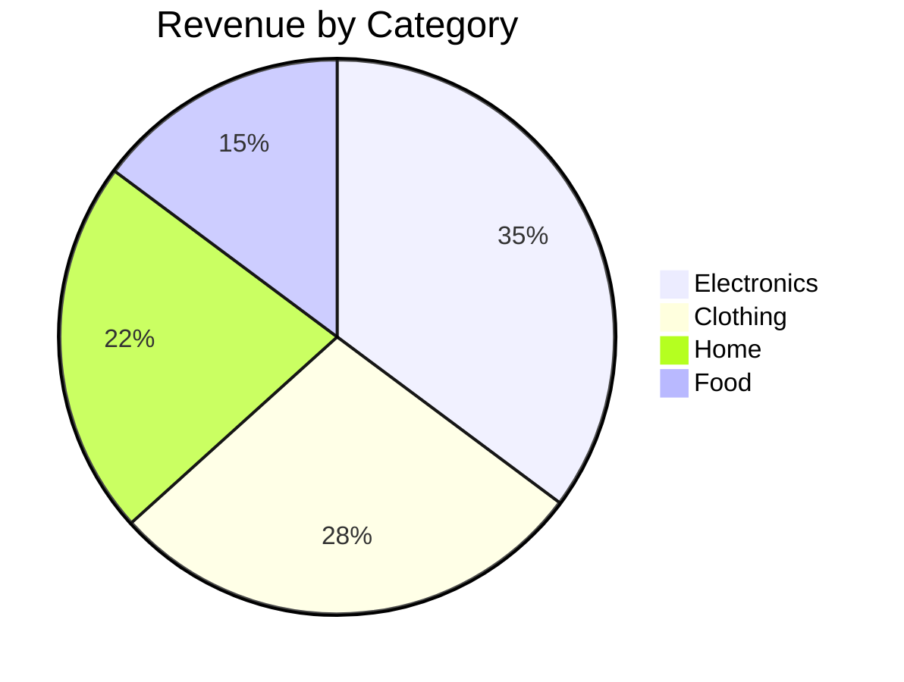

# Data Pipeline — ETL, Analysis & Reporting

An end-to-end data processing pipeline for extracting, cleaning, analyzing, visualizing, and reporting on structured data.

## Activation Triggers

| Trigger Phrase | When to Use |
|---|---|
| "analyze [this data]" | Any data analysis request |
| "process [CSV/JSON/SQL]" | Explicit data processing task |
| "clean [this dataset]" | Data cleaning and preparation |
| "generate report from [data]" | Report generation from data sources |
| "ETL [source] to [destination]" | Extract-transform-load workflows |
| "what insights in [this data]" | Exploratory data analysis |
| "visualize [metric]" | Chart or visualization request |

## Pipeline Architecture

```
┌──────────┐    ┌─────────┐    ┌───────────┐    ┌──────────┐    ┌──────────┐    ┌─────────┐
│ EXTRACT  │ → │  CLEAN  │ → │ TRANSFORM │ → │ ANALYZE  │ → │VISUALIZE │ → │ REPORT  │
│  Load    │   │  Fix    │   │  Shape    │   │  Query   │   │  Chart   │   │ Deliver │
└──────────┘    └─────────┘    └───────────┘    └──────────┘    └──────────┘    └─────────┘
```

### Phase 1: EXTRACT — Load Data

Supported data sources and loading methods:

| Source | Method |
|---|---|
| **CSV/TSV files** | `read(path)` or `exec("python3 -c 'import pandas; ...'")` |
| **JSON files** | `read(path)` or `exec("cat data.json | python3 -m json.tool")` |
| **SQLite databases** | SQLite MCP — `sqlite:///path/to/db.sqlite` |
| **Web APIs** | `web_fetch(url)` for JSON APIs or `exec("curl ...")` |
| **Web scraping** | `web_fetch(url, extractMode="text")` or `browser-automation` skill for dynamic pages |
| **Log files** | `read(path)` or `exec("grep/awk/sed ...")` |
| **Spreadsheets (XLSX)** | `exec("python3 -c 'import openpyxl; ...'")` |

**First step always**: Inspect the data structure

```
read data.csv limit=20          # Preview first 20 rows
exec wc -l data.csv             # Count total records
exec head -1 data.csv           # Check column headers
exec file data.csv              # Verify file type and encoding
```

### Phase 2: CLEAN — Data Quality

Common cleaning operations:

| Issue | Fix |
|---|---|
| **Missing values** | Fill with mean/median/mode, or drop rows |
| **Duplicates** | `sort -u` or pandas `drop_duplicates()` |
| **Inconsistent formatting** | Standardize dates, trim whitespace, normalize case |
| **Outliers** | IQR method, z-score filtering |
| **Wrong types** | Cast strings to numbers/dates |
| **Encoding issues** | `iconv -f <enc> -t UTF-8` |
| **BOM/whitespace** | `sed 's/^\xEF\xBB\xBF//'` or `dos2unix` |

**Cleaning script template:**

```python
import pandas as pd
import sys

df = pd.read_csv(sys.argv[1])

# 1. Normalize column names
df.columns = [c.strip().lower().replace(' ', '_') for c in df.columns]

# 2. Drop fully empty rows
df = df.dropna(how='all')

# 3. Convert numeric columns
for col in ['price', 'quantity', 'amount']:
    if col in df.columns:
        df[col] = pd.to_numeric(df[col].str.replace(r'[$,]', '', regex=True), errors='coerce')

# 4. Fill missing values
df['category'] = df['category'].fillna('Unknown')

# 5. Drop duplicates
before = len(df)
df = df.drop_duplicates()
print(f"Removed {before - len(df)} duplicates")

df.to_csv(sys.argv[2], index=False)
print(f"Saved {len(df)} clean records to {sys.argv[2]}")
```

Execute with: `exec("python3 clean.py raw_data.csv clean_data.csv")`

### Phase 3: TRANSFORM — Shape & Structure

Transformations for analysis readiness:

| Operation | Command/Code |
|---|---|
| **Filter rows** | `exec("awk -F',' '$3 > 100' data.csv")` or pandas query |
| **Select columns** | `exec("cut -d',' -f1,3,5 data.csv")` |
| **Aggregate** | `exec("awk -F',' '{sum[$1]+=$3} END {for (k in sum) print k, sum[k]}' data.csv")` |
| **Join/merge** | SQLite MCP: `CREATE TABLE ... AS SELECT ... JOIN ...` |
| **Pivot** | pandas `df.pivot_table()` |
| **Date parsing** | pandas `pd.to_datetime()` |
| **Group by** | SQL: `SELECT category, COUNT(*), AVG(price) FROM data GROUP BY category` |
| **Window functions** | SQL: `SELECT *, ROW_NUMBER() OVER (PARTITION BY category ORDER BY date)` |

### Phase 4: ANALYZE — SQL & Python

#### SQL Analysis via SQLite MCP

Load data into SQLite for powerful querying:

```sql
-- Import CSV into SQLite
.mode csv
.import clean_data.csv sales

-- Basic stats
SELECT 
    COUNT(*) as total_rows,
    COUNT(DISTINCT category) as unique_categories,
    MIN(date) as date_from,
    MAX(date) as date_to,
    ROUND(AVG(amount), 2) as avg_amount,
    ROUND(SUM(amount), 2) as total_revenue
FROM sales;

-- Trend analysis
SELECT 
    strftime('%Y-%m', date) as month,
    COUNT(*) as transactions,
    ROUND(SUM(amount), 2) as revenue,
    ROUND(AVG(amount), 2) as avg_order_value
FROM sales
GROUP BY month
ORDER BY month;

-- Top performers
SELECT 
    category,
    COUNT(*) as count,
    ROUND(SUM(amount), 2) as total,
    ROUND(AVG(amount), 2) as avg
FROM sales
GROUP BY category
ORDER BY total DESC
LIMIT 10;

-- YoY comparison
SELECT 
    category,
    ROUND(SUM(CASE WHEN strftime('%Y', date) = '2023' THEN amount ELSE 0 END), 2) as revenue_2023,
    ROUND(SUM(CASE WHEN strftime('%Y', date) = '2024' THEN amount ELSE 0 END), 2) as revenue_2024,
    ROUND((SUM(CASE WHEN strftime('%Y', date) = '2024' THEN amount ELSE 0 END) - 
           SUM(CASE WHEN strftime('%Y', date) = '2023' THEN amount ELSE 0 END)) / 
           SUM(CASE WHEN strftime('%Y', date) = '2023' THEN amount ELSE 0 END) * 100, 1) as yoy_change_pct
FROM sales
GROUP BY category;
```

#### Python Statistical Analysis

For advanced analysis beyond SQL:

```python
import pandas as pd
import numpy as np

df = pd.read_csv('clean_data.csv')

# Descriptive statistics
print(df.describe())

# Correlation matrix
print(df.select_dtypes(include=[np.number]).corr())

# Distribution analysis
for col in df.select_dtypes(include=[np.number]).columns:
    print(f"\n{col}:")
    print(f"  Mean: {df[col].mean():.2f}")
    print(f"  Median: {df[col].median():.2f}")
    print(f"  Std: {df[col].std():.2f}")
    print(f"  Skewness: {df[col].skew():.2f}")
    print(f"  Q1: {df[col].quantile(0.25):.2f}")
    print(f"  Q3: {df[col].quantile(0.75):.2f}")
    print(f"  IQR: {df[col].quantile(0.75) - df[col].quantile(0.25):.2f}")
```

### Phase 5: VISUALIZE — Charts & Diagrams

#### ASCII Charts (Quick, Always Available)

```
Monthly Revenue Trend:
Jan 2024  ████████████████░░░░░░░░░ $45,200
Feb 2024  ██████████████████████░░░ $52,100
Mar 2024  █████████████████░░░░░░░░ $48,300
Apr 2024  ██████████████████████░░░ $53,900
May 2024  ██████████████████████████ $58,700
Jun 2024  ██████████████████████████ $57,200
```

Generate with: `exec("python3 -c 'import pandas as pd; df=pd.read_csv(\"data.csv\"); ...'")`

#### Markdown Tables

```
| Category    | Revenue    | Orders | Avg Order |
|-------------|-----------|--------|-----------|
| Electronics | $234,500  | 1,203  | $194.93   |
| Clothing    | $187,200  | 3,456  | $54.17    |
| Home        | $145,800  | 2,101  | $69.40    |
| Food        | $98,400   | 5,678  | $17.33    |
```

#### Mermaid Diagrams

For flow diagrams, relationship maps:




#### Python-Generated Charts (when available)

```python
# If matplotlib is available
import matplotlib.pyplot as plt
df.groupby('month')['revenue'].sum().plot(kind='bar')
plt.savefig('/tmp/revenue_chart.png')
```

### Phase 6: REPORT — Deliver

Final report structure:

```markdown
# [Dataset Name] — Analysis Report
**Date:** YYYY-MM-DD
**Records processed:** N
**Date range:** YYYY-MM-DD to YYYY-MM-DD

---

## Executive Summary
*Key insights in 3-5 bullet points.*

---

## Data Overview
| Metric | Value |
|---|---|
| Total records | N |
| Columns | N |
| Complete rows | N (X%) |
| Date range | ... to ... |

---

## Key Metrics
| Metric | Value | Change |
|---|---|---|
| Total Revenue | $X | +Y% |
| Avg Order Value | $X | ... |
| ... |  |  |

---

## Trends & Patterns
[ASCII chart or mermaid diagram]
[Narrative analysis of patterns]

---

## Top/Bottom Analysis
[Top 10 table]
[Bottom 10 table]

---

## Anomalies & Outliers
[Flagged data points with explanation]

---

## Recommendations
1. Actionable insight → suggested action
2. ...

---

## Appendix: Data Quality Notes
- Missing values handled: X rows in column Y
- Outliers removed: X rows (Z% of total)
- Transformations applied: [list]
```

## Example Workflows

### Example 1: Sales Analysis
```
User: "Analyze sales_2024.csv — show me trends, top products, and seasonal patterns"
→ Extract: read sales_2024.csv, inspect schema
→ Clean: normalize dates, handle missing values, remove obvious errors
→ Transform: create month/week columns, calculate derived metrics
→ Analyze: SQL aggregation by month/category/product
→ Visualize: monthly revenue bar chart, category pie chart
→ Report: 800-word analysis with tables, charts, and recommendations
```

### Example 2: Log Analysis
```
User: "Process these nginx access logs — find top errors, slowest endpoints, traffic patterns"
→ Extract: exec("cat access.log* | ...") or read if single file
→ Clean: parse log format, normalize timestamps
→ Transform: extract status codes, response times, endpoints
→ Analyze: SQL for error rates, p95/p99 latency, traffic by hour
→ Visualize: hourly traffic pattern, endpoint latency distribution
→ Report: Performance summary with actionable optimization recommendations
```

### Example 3: Survey Results
```
User: "I have survey_results.csv — analyze responses, find correlations, create summary"
→ Extract: read CSV, map question codes to labels
→ Clean: handle missing responses, validate answer ranges
→ Transform: pivot for cross-tabulation, calculate NPS/CSAT scores
→ Analyze: correlation matrix, sentiment by demographic segment
→ Visualize: satisfaction distribution, segment comparison table
→ Report: Executive summary, detailed findings by question, recommendations
```

### Example 4: ETL Pipeline
```
User: "ETL: extract users from the SQLite DB, clean and dedupe, load into a new table"
→ Extract: SQLite MCP — SELECT * FROM users_raw
→ Clean: normalize emails, remove test accounts, deduplicate by email
→ Transform: add derived fields (domain, signup_cohort, engagement_score)
→ Load: CREATE TABLE users_clean AS SELECT ...
→ Verify: run validation queries, compare row counts
→ Report: Summary of ETL results (rows in → rows out, issues found)
```

## Performance Tips

- **Preview before full load**: Always peek at the first 20 rows before processing the whole file
- **Filter early**: Apply filters as early in the pipeline as possible to reduce data volume
- **Use SQL for aggregation**: SQLite is faster than pandas for large aggregations
- **Batch parallel independent operations**: Clean & transform independent columns in parallel
- **Cache intermediate results**: Save cleaned data to avoid re-processing

---

*The data pipeline skill provides a systematic framework for any data processing task. Adapt the phases to your specific data source and analysis needs.*
