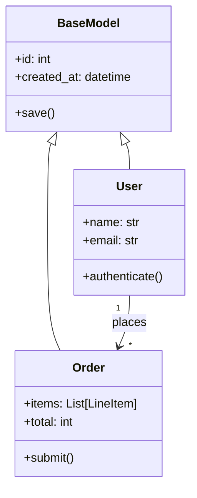
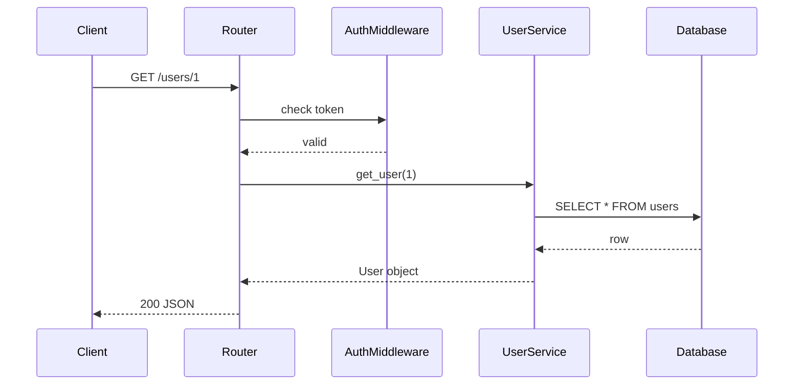

# Doc Generator

Generate documentation from source code — docstrings, API docs, README files, and architecture diagrams.

## Workflow

1. **Scan code** — read target files or directories, identify public symbols, classes, functions, routes
2. **Extract structure** — signatures, parameters, return types, decorators, route registrations
3. **Determine doc type** — confirm with user: docstrings? API reference? README? Architecture?
4. **Generate docs** — produce Markdown output with consistent formatting
5. **Integrate** — insert docstrings in-place, or write standalone `.md` files

### Ask before starting:

```
What output do you need?
1. Inline docstrings (Python/TypeScript)
2. API reference doc (Markdown)
3. README.md for the project
4. Architecture / module overview with diagrams
```

---

## Python Docstring Generation (Google Style)

### Before:
```python
def create_user(db: Session, name: str, email: str, role: str = "user") -> User:
    if "@" not in email:
        raise ValueError("Invalid email")
    user = User(name=name, email=email, role=role)
    db.add(user)
    db.commit()
    return user
```

### After:
```python
def create_user(db: Session, name: str, email: str, role: str = "user") -> User:
    """Create a new user and persist to database.

    Validates the email format before insertion. The user is committed
    to the database within the current transaction.

    Args:
        db: Active SQLAlchemy database session.
        name: The user's display name (non-empty).
        email: The user's email address. Must contain '@'.
        role: Access role for the user. Defaults to "user".

    Returns:
        The newly created User object with its database-assigned ID.

    Raises:
        ValueError: If email does not contain '@'.

    Example:
        >>> user = create_user(db, "Alice", "alice@example.com", role="admin")
        >>> user.id
        1
    """
    if "@" not in email:
        raise ValueError("Invalid email")
    user = User(name=name, email=email, role=role)
    db.add(user)
    db.commit()
    return user
```

### Class docstring:
```python
class UserService:
    """Manage user lifecycle operations.

    Handles creation, authentication, permission checks, and
    profile updates. All methods require an active database session.

    Attributes:
        db: SQLAlchemy Session for database operations.
        cache: Redis client for caching user lookups.

    Example:
        svc = UserService(db=session, cache=redis_client)
        svc.authenticate("alice@example.com", "s3cret")
    """
```

---

## TypeScript / JavaScript (TSDoc / JSDoc)

### Before:
```typescript
async function fetchOrders(
  userId: string,
  status?: OrderStatus,
  limit: number = 20
): Promise<Order[]> {
  const params = new URLSearchParams({ userId });
  if (status) params.set("status", status);
  params.set("limit", String(limit));
  const res = await fetch(`/api/orders?${params}`);
  if (!res.ok) throw new Error(`HTTP ${res.status}`);
  return res.json();
}
```

### After:
```typescript
/**
 * Fetch orders for a user with optional status filtering.
 *
 * Hits `GET /api/orders` with query parameters. Throws on non-2xx
 * responses — callers should handle network errors.
 *
 * @param userId - The user's unique identifier (UUID).
 * @param status - Optional order status filter ("pending" | "shipped" | "cancelled").
 * @param limit - Maximum number of orders to return. Defaults to 20.
 * @returns A promise resolving to an array of Order objects, newest first.
 * @throws {Error} If the HTTP response status is not 2xx.
 *
 * @example
 * ```ts
 * const orders = await fetchOrders("user-123", "pending", 10);
 * console.log(orders.length); // ≤ 10
 * ```
 */
async function fetchOrders(
  userId: string,
  status?: OrderStatus,
  limit: number = 20
): Promise<Order[]> {
  // ... body unchanged
}
```

### Interface / Type docs:
```typescript
/** A single item in an order. */
export interface LineItem {
  /** Product SKU (stock-keeping unit). */
  sku: string;
  /** Quantity ordered. Must be > 0. */
  quantity: number;
  /** Per-unit price in cents (e.g., 1099 = $10.99). */
  unitPrice: number;
}
```

---

## API Endpoint Documentation (From Route Definitions)

Scan route files and generate API docs.

### Flask / FastAPI Example

Source (`api/users.py`):
```python
@router.get("/users/{user_id}", response_model=UserResponse)
async def get_user(user_id: int, include_orders: bool = False):
    ...
```

Generated Markdown:
```markdown
## GET /users/{user_id}

Retrieve a single user by ID.

| Parameter | Type | Required | Default | Description |
|-----------|------|----------|---------|-------------|
| `user_id` | `int` | ✅ | — | Path: user identifier |
| `include_orders` | `bool` | ❌ | `false` | Include user's order history |

**Response** `200`: `UserResponse`
```json
{
  "id": 1,
  "name": "Alice",
  "email": "alice@example.com",
  "orders": []
}
```

**Errors**:
- `404` — User not found
- `422` — Validation error
```

### Express.js Example

Source (`routes/orders.ts`):
```typescript
router.get('/orders', authMiddleware, async (req, res) => {
  const orders = await OrderService.list(req.user!.id);
  res.json(orders);
});
```

Generated Markdown:
```markdown
## GET /orders

List orders for the authenticated user.

**Auth**: Bearer token required  
**Query Params**:
| Param | Type | Default | Description |
|-------|------|---------|-------------|
| `status` | `string` | — | Filter by status |
| `page` | `int` | `1` | Page number |
| `limit` | `int` | `20` | Items per page |

**Response** `200`:
```json
[{ "id": "ord_1", "status": "pending", "total": 4200 }]
```
```

---

## README.md Generation (From Project Structure)

Scan the project and generate:

```markdown
# Project Name

Brief description (inferred from package metadata or top-level comment).

## Quick Start

```bash
pip install -e .          # Python
npm install               # Node.js
go mod download           # Go
```

## Project Structure

```
src/
├── api/          # HTTP route handlers
├── models/       # Database models
├── services/     # Business logic
└── utils/        # Shared utilities
tests/            # Test suite
```

## Usage

```python
from mypackage import Client
client = Client(api_key="...")
client.do_thing()
```

## Development

```bash
pytest --cov    # Run tests with coverage
black .         # Format code
mypy src/       # Type check
```
```

---

## Architecture Diagrams (Mermaid)

Generate Mermaid diagrams from module structure:

### Class hierarchy


### Request flow


See `references/doc_templates.md` for reusable doc templates.
