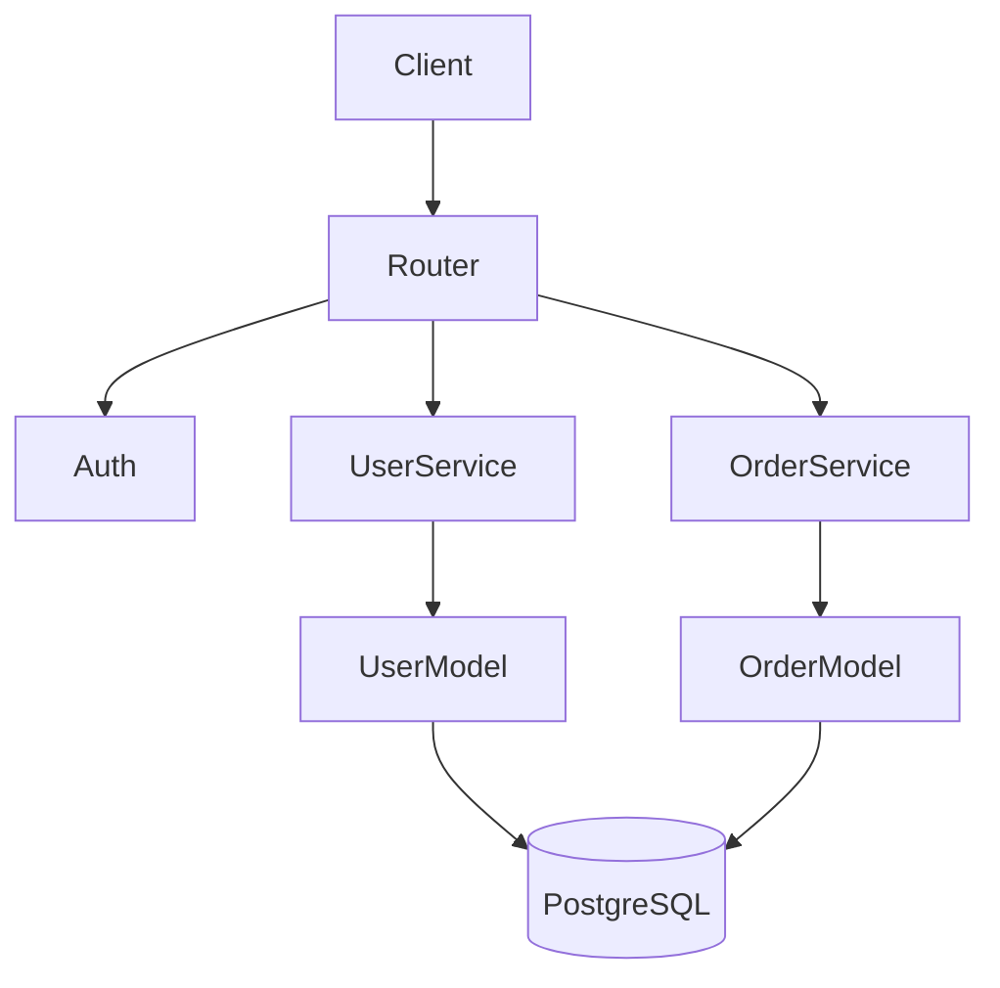

# Documentation Templates

Copy-paste starting points. Adapt fields as needed.

## Google-Style Python Docstring

```python
def function_name(param1: Type, param2: Type = default) -> ReturnType:
    """One-line summary of what this function does.

    More detailed explanation across multiple lines if needed.
    Mention important behavior, side effects, or caveats.

    Args:
        param1: Description of param1. Include type constraints.
        param2: Description of param2. Defaults to `default`.

    Returns:
        Description of the return value. What it represents.

    Raises:
        ValueError: When param1 is negative.
        KeyError: If a required key is missing from some mapping.

    Example:
        >>> result = function_name(10, True)
        >>> print(result)
        42
    """
```

## JSDoc / TSDoc Block

```typescript
/**
 * One-line summary.
 *
 * Longer description with details, caveats, or performance notes.
 * Can span multiple paragraphs.
 *
 * @param paramName - Description of the parameter.
 * @param optionalParam - Description. Defaults to `someValue`.
 * @returns Description of the return value.
 * @throws {ErrorType} When and why this throws.
 *
 * @example
 * ```ts
 * const result = myFunction(42);
 * console.log(result); // expected output
 * ```
 *
 * @see {@link RelatedClass} for more context.
 */
export function myFunction(
  paramName: string,
  optionalParam: number = 0
): ResultType {
  // ...
}
```

## README.md Template

```markdown
# Project Name

> One-line tagline or description.

## Features

- Feature one
- Feature two

## Quick Start

```bash
# Install
npm install my-package

# Or clone and run
git clone https://github.com/user/repo.git
cd repo
npm install && npm run dev
```

## Usage

```typescript
import { Client } from 'my-package';

const client = new Client({ apiKey: '...' });
const result = await client.doThing();
```

## API

See [API Reference](./docs/api.md) for full documentation.

## Contributing

1. Fork the repo
2. Create a feature branch (`git checkout -b feat/amazing`)
3. Commit changes (`git commit -m 'Add amazing feature'`)
4. Push to branch (`git push origin feat/amazing`)
5. Open a Pull Request

## License

MIT © 2024 Your Name
```

## Architecture Doc Template

```markdown
# Architecture Overview

## Directory Structure

```
src/
├── routes/       # HTTP handlers — thin, delegates to services
├── services/     # Business logic — stateless, depends on models
├── models/       # Database models / entities
├── middleware/   # Express middleware (auth, logging, CORS)
├── utils/        # Pure utility functions
└── config/       # Environment & app configuration
```

## Data Flow

1. **Request** → Router (`routes/`)
2. Router → validates input, calls **Service** (`services/`)
3. Service → applies business rules, uses **Model** (`models/`) for persistence
4. Model → maps to database via ORM
5. Response flows back through the same chain

## Key Design Decisions

| Decision | Rationale |
|----------|-----------|
| Stateless services | Easier to test, no shared mutable state |
| Thin controllers | Business logic belongs in services, not routes |
| Repository pattern | Swap database backends without touching services |

## Mermaid: Component Diagram


```
